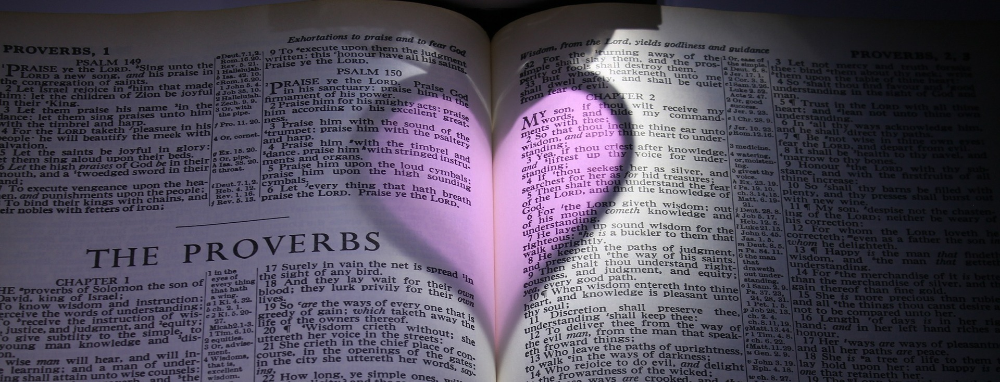

# Des déclarations inspirées des Proverbes

?> Je crois très sincèrement - comme pouvait le faire le roi David - que  déclarer ce que Dieu dit de nous, est salutaire pour mon âme.

## <b>CHAPITRE I</b>

> {{ msg }}

Je consulterai avec profit les proverbes et j'y trouverai des directives pour comprendre leur sens caché et les propos énigmatiques de ceux qui enseignent la sagesse. Je reconnai l'autorité du Seigneur : c'est l'ABC de ma sagesse. j'écouterai les avertissements de mon père et les conseils de ma mère. Les avertissements de la sagesse, répondent sur moi son Esprit et éclairent mes conseils.

## <b>CHAPITRE II</b>

> {{ msg }}

J'écoute les leçons de la sagesse, je m'efforce de les comprendre. Je demande de l'aide à l'intelligence et j'appelle la raison au secours. Je les cherche comme l'argent, comme un trésor caché. L'Eternel m'aide et me protège comme un bouclier. Il me secour et me garde à cause de mon équité, mon intégrité et ma droiture : c'est le chemin du bonheur. La sagesse est entrée dans mon coeur, la connaissance me donne de la joie, la réflexion me garde de l'erreur et la raison veille sur moi. Je choisis la conduite des bons et j'imite le comportement des justes. J'habiterai ce pays dans la loyauté et l'intégrité.

## <b>CHAPITRE III</b>

> {{ msg }}

Grâce aux conseils je connaîtrai le bien-être et une vie longue et heureuse. Je pratique la bonté et la fidélité. Dieu et les hommes m'aiment et apprecient mon bon sens. Je ne me fie pas à ma propre intelligence, mais je place ma confiance dans le Seigneur. J'honore le Seigneur en lui offrant une part de mes revenus : le meilleur de mes récoltes. J'accepte que le Seigneur soit mon éducateur. Je suis heureu car j'ai trouvé la sagesse et découvert la raison. Elles m'aident à vivre longtemps, elles me procurent prospérité et bonheur, elles me dirigent sur des sentiers agréables en toute sécurité. Le discernement et la réflexion, voilà mon guide. Grâce à eux je vis une vie véritable et belle. J'avance avec assurance, aucun obstacle ne me fera tomber. Le soir je me couche sans peur, la nuit mon sommeil est paisible. L'Eternel me garde en sécurité, il écarte tout piège de mes pas, je ne crains rien. Chaque fois que j'en ai la possibilité, je n'hésite pas à faire le bien à ceux qui en ont besoins. Le Seigneur me traite avec bonté, car je suis humble. Il m'honore parceque je suis sage.

## <b>CHAPITRE IV</b>

> {{ msg }}

J'acquièrs la sagesse et l'intelligence et je ne les oublierai plus. J'aime la sagesse et je donne tout ce que je possede pour acquerir l'intelligence. Je ne renierai jamais l'éducation que j'ai reçu; c'est la base de ma vie : j'y reste attaché. Par dessus tout je prendrais garde à ce que je penses au fond de moi-même : ma vie en dépend. Je garde mes yeux fixés droit devant moi. Je réfléchis au chemin que je vais prendre pour engager mes pas dans une direction sûre.

## <b>CHAPITRE V</b>

> {{ msg }}

Je prête une oreille attentive aux paroles pleines de sagesse et d'intelligence. Je me tiens éloigné du mari d'autruie; je ne le laisse même pas s'approcher du seuil de ma maison. Pour le mien je suis comme une source d'eau pure. Il bois à cette source ! Je ne laisse pas mon eau couler dans les rues et se disperser sur les places publiques. Qu'elle soit pour lui seul ! Je ne la partage pas avec des étrangers. Il est remplie de bonheur, trouve sa joie dans la campagne de sa jeunesse. Il me trouve aimable, et gracieuse comme la gazelle. Mon corps le comble toujours de plaisir. Je m'abandonne sans cesse à son amour. Pourquoi l'abandonnerais-je à une autre ? Pourquoi chercherais-je le plaisir auprès d'un étranger ?

Je prête une oreille attentive aux paroles pleines de sagesse et d'intelligence. Je me tiens éloigné de la femme d'autruie; je ne m'approche même pas du seuil de sa maison. La mienne est comme une source d'eau pure. Je bois à cette source ! Je ne laisse pas son eau couler dans les rues et se disperser sur les places publiques. Qu'elle soit pour moi seul ! Je ne la partage pas avec des étrangers. Je la remplie de bonheur, je trouve ma joie dans la campagne de ma jeunesse. Ma femme est aimable, et gracieuse comme la gazelle. Que son corps me comble toujours de plaisir. Je m'abandonne sans cesse à son amour. Pourquoi m'abandonnerais-je à la femme d'un autre ? Pourquoi chercherais-je le plaisir auprès d'une étrangère ?

## <b>CHAPITRE VI</b>

> {{ msg }}

Je ne m'accorde aucun repos et je ne ferme pas l'oeil avant de parvenir à me libérer d'une créance. J'observe la fourmie pour en tirer une leçon de sagesse. Je tiens compte des recommendadtions de mon père et de l'enseignement de ma mère.

## <b>CHAPITRE VII</b>

> {{ msg }}

La Sagesse est ma soeur, l'intelligence mon ami

## <b>CHAPITRE VIII</b>

> {{ msg }}

J'apprends à avoir du bon sens et de l'esprit. Je recherche l'éducation plus que l'argent, la connaissance plus que l'or pur. Je déteste le mal, car je suis soumis au Seigneur. Je suis le conseil de la sagesse, je l'écoute et je la trouve.

## <b>CHAPITRE IX</b>

> {{ msg }}

Je me nourris à la table de la sagesse et je bois le vin qu'elle a préparée. Je prends le chemin de l'intelligence. Je ne critique que les sages. Je reconnais l'autorité du Seigneur, comme le commencement de ma sagesse.

## <b>CHAPITRE X</b>

> {{ msg }}

Je suis sage et je fait la joie de mes parents. Ma conduite est juste, elle me préserve de la mort. Le Seigneur ne me laisse pas avoir faim. Mes mains sont actives, elles me procurent la richesse. J'amasse mes provisions pendant l'été et j'attire sur moi le bonheur. On se souviendra de moi avec reconnaissance. J'accepte avec joie les directives. Je vis dans la sécurité, parceque je vis dans l'intégrité. Je reprends les autres avec franchise pour apporter la paix. Mes paroles sont sources de vie. Je ne tiens pas compte des offenses, par amour. Mes paroles sont intelligentes, on y reconnait la sagesse. J'amasse un trésor d'expérience et ma fortune me tient lieu de place forte. Mon travail me permet de vivre. j'avance dans la vie, parceque je tiens compte des avertissements. Je suis prudent, c'est pourquoi je tiens ma langue. Mes parole valent l'argent le plus pur, et profitent à beaucoups. C'est la bénédiction du Seigneur qui me donne la prospérité. La pratique de la sagesse est un jeu pour moi. Mes souhaient me sont accordés, alors je tiens toujours debout, même après l'ouragan. Je vivrais longtemps, puisque je reconnais l'autorité du Seigneur. Mon espérance me procure la joie. Les plans du Seigneur me protège comme une forteresse, rien ne me fera jamais tomber. Des paroles sages sortent de ma bouche; le tout avec bienveillance.

## <b>CHAPITRE XI</b>

> {{ msg }}

J'utilise toujours des poids exact. Je suis modeste, intègre et juste. Mon intégrité me met sur le droit chemin. Ma justice me préserve la vie de l'inquiétude, grâce à mon expérience. J'apporte la prospérité autour de moi. Mon intelligence me pousse à me taire. Je suis digne de confiance; je garde tout pour moi.Ma bonté me fait du bien. La justice que je propage m'assure une récompense certaine. Ma justice me préserve la vie. Le Seigneur m'approuve pour mon intégrité. J'échapperais à la punition à cause de ma justice. Mon unique désir est de bien agir. Je donne kargement c'est pourquoi ma fortune s'accroie. Je suis généreu c'est pourquoi, je suis comblé de bien en retour, je donne à boire c'est pourquoi je suis désaltéré. Je suis approuvé parceque j'agis bien. Je prospère comme un arbre verdoyant. J'oriente bien ma maison. Mes actes sont comme un arbre de vie, ils gagnent les coeurs, j'ai ma récompense sur la terre.

## <b>CHAPITRE XII</b>

> {{ msg }}

J'aime la correction, parce que j'aime la science. J'obtiens la faveur de l'Eternel à cause de ma bonté et ma racine ne sera pas ébranlée. Ma femme est vertueuse, elle est ma couronne. Mes pensées ne sont qu'équité et ma bouche une délivrance. Ma maison reste debout. Je suis estimé à cause de mon intelligence, je reste humble. Je prends soin de mon bétail et je cultive mon champ, c'est pourquoi je suis rassasié de pain. Ma racine donne du fruit et je me tire de la détresse. Je suis rassasié de bien par le fruit de ma bouche te je reçois selon l'œuvre de mes mains. Je suis sage c'est pourquoi j'écoute les conseils. Je suis prudent, c'est pourquoi je me garde de montrer ma colère. Je proclame la justice en disant la vérité, je suis affermie pour toujours. J'apporte la guérison par des paroles pleine de sagesse. Je conseil la paix, cela me procure de la joie. Aucun malheur ne m'arrive à cause de ma justice. Je suis agréable à l'Eternel, parce que j'agis avec vérité. Je cache ma science par prudence. Ma main est diligente, c'est pourquoi elle domine. Je me réjouis en me nourrissant de bonnes paroles. Je montre à mes amis la bonne voie. L'activité est mon précieux trésor. La vie est dans mon sentier : un sentier de justice.

## <b>CHAPITRE XIII</b>

> {{ msg }}

Je tiens compte des avertissements de mon père. Je récolterai le fruit de mes patroles, c'est pourquoi je surveil ma bouche, afin de mettre ma vie à l'abrie. je suis actif c'est pourquoi j'obtiens ce que je désire. Je suis juste et je déteste le mensonge. L'honnêteté me protège, puisque je me conduit bien. Je rayonne comme une lumière brillante. Je trouve plus sage d'accepter les conseils et d'acquerir ma richesse petit à petit. Mes désires comblés sont comme un arbre de vie. Je respecte les ordres, c'est pourquoi je suis récompensé. Mon enseignement est sages et source de vie. Mon bon sens fait mon charme. Je suis avisé, je réfléchis donc avant d'agir. Je rétablis les situation par ma fidélité quand j'en ai la responsabilité. Je tiens compte des critiques, c'est pourquoi je suis honoré. Je fréquente les sages pour gagner en sagesse. Le bonheur est la récompense de mon honnêteté. Je laisserai un héritage pour mes enfants; je n'hésiterai pas à les punir par amour. Nous mangerons à satiété.

## <b>CHAPITRE XIV</b>

> {{ msg }}

Je suis sage, j'assure la solidité de notre foyer. Je mène une vie   droite par respect pour le Seigneur. Mes paroles sages assurent ma protection; je suis  un témoin digne de confiance. Je réfléchis, c'est pourquoi j'acquiers facilement du savoir faire. Je surveille ma conduite par prudence et je suis pleinne de bonne volontées. Ma maison est destinée à la prospérité; dans ma prudence je reghardes où je mets mes pieds, car j'ai peur du mal et je m'en détourne. Le savoir fait mon honneur. Je suis bonne avec les pauvres. Mes bonnes intentions me font rencontrées la bonté et la fidélité. Mon travail m'assure un salaire et la richesse est ma récompense. Par mon témoignage digne de foi, des vies sont sauvées. Je vis en toute sécurité, parceque je reconnais l'autorité du Seigneur. Par intéllignece, je reste calme et pour ma santé, je cultive la paix. Je porte secours aux indigents pour honorer  celui qui les a faits; je pratique la justice. Je suis apprécié pour ma compétence.

Ma femme est sage, elle assure la solidité de notre foyer. Je mène une vie   droite par respect pour le Seigneur. Mes paroles sages assurent ma protection; je suis  un témoin digne de confiance. Je réfléchis, c'est pourquoi j'acquiers facilement du savoir faire. Je surveille ma conduite par prudence et je suis plein de bonne volontées. Ma maison est destinée à la prospérité; dans ma prudence je reghardes où je mets mes pieds, car j'ai peur du mal et je m'en détourne. Le savoir fait mon honneur. Je suis bon avec les pauvres. Mes bonnes intentions me font rencontrées la bonté et la fidélité. Mon travail m'assure un salaire et la richesse est ma récompense. Par mon témoignage digne de foi, des vies sont sauvées. Je vis en toute sécurité, parceque je reconnais l'autorité du Seigneur. Par intéllignece, je reste calme et pour ma santé, je cultive la paix. Je porte secours aux indigents pour honorer  celui qui les a faits; je pratique la justice. Je suis apprécié pour ma compétence.

## <b>CHAPITRE XV</b>

> {{ msg }}

Je donne des réponses toujours aimable et mes paroles sont réconfortantes. Je suis avisé c'est pourquoi j'accepte la réprimende et cela me fait vivre dans l'abondance. Mes paroles diffuse le savoir. L'Eternel reçoit favorablement mes prière, Il connait mes pensées et Il m'aime parce que je pratique la justice. Je consulte les sages. Mon visage s'egaie à cause de la joie dans mon coeur ce bonheur me fait vivre dans une fête continuelle. Je l'ardent désir de m'instruire. Avec ce que je possède je vis soumis au Seigneur, je mange des plats modeste, mais préparé avec amour. J'apaise les disputes par ma patience et ma route est bien dégagée. Je suis raisonnable et cela fait la joie de mes parents. Les nombreux conseils que je reçois, assurent la réussite de mes projets. Je trouve agréable de savoir bien  répondre et trouver les mots juste au bon moment. Je suis la route qui monte vers la vie et le Seigneur protège mon terrain. Mes paroles sont inspirées par la bonté. Je jouirais d'une longue vie, parce que je ne me laisse pas acheter. Je réflechis avant de répondre. Je sais que l'Eternel écoute ma prière. Le regard bienveillant me donne de la joie et les bonnes nouvelles me revigorent. Je suis attentif à la critique salutaire, j'ai donc ma place parmis les sages; leurs réprimendes me font acquerir du caratère. Je reconnait l'autorité du Seigneur: je suis à son école. Je m'humilie avant d'acceder au honneur.

## <b>CHAPITRE XVI</b>

> {{ msg }}

Je forme des projets mais je laisse au Seigneur le dernier mot. Il examine le fond de mon coeur. J'expose mon activité au Seigneur et mes projets se réalisent. Par la bonté et la fidélité je répare mes torts: je respect le Seigneur. Il approuve ma conduite et pousse mes ennemis à se reconcilier avec moi. Je préfère un maigre salaire gagné honnêtement que de gros revenus tirés d'affaire louches. J'élabore des plans, le Seigneur en dirige la réalistaion. Je parle avec une autorité divine, pour ne pas me tromper dans mes jugements. Je laisse le Seigneur fixer la valeur des poids, pour avoir une balance juste. La pratique de la justice maintien mon pouvoir. j'aime qu'on me parle honnêtement et qu'on me dise la vérité. En toute sagesse, je fait tout pour apaiser la colère. Par le sourire sur mon visage je proclame la vie, ma bonté est comme une pluie rafraichissante.

Je préfère acquerir la sagesse que de l'or, l'intelligence que de l'argent. Je me détourne  du mal car surveiller ma conduite, c'est veiller sur ma vie. Je préfère vivre modestement avec des pauvres que partager un riche butin avec des orgueilleux. Je connais le bonheur, parce que je fais confiance au Seigneur. Mon esprit sage me rend intelligent. Mes paroles sont aimables c'est pourquoi elles sont convaincantes. Le bon sens me procure la vie. Je réflechis avant de parler, ce qui rend mes paroles encores plus convaincantes. Mes paroles aimables sont pareilles au miel qui est agréable au goût et bon pour la santé. Mes cheuveux blancs sont une parure qui me couronne pour avoir suivit les traces de la justice. Je suis un héros pour avoir vainc ma colère. Je préfère être maître de mon moi que d'être le maître d'une ville. C'est le Seigneur qui détermine mon avenir.

## <b>CHAPITRE XVII</b>

Je préfère manger en paix un crouton sec, que de participer à un banquet dans une maison où l'on se dispute. Je suis un serviteur compétent, c'est pourquoi je suis traité comme un fils. C'est le Seigneur qui éprouve ma valeur. Je ne prête pas l'oreille aux paroles malveillantes et je n'écoute pas les mauvaises langues. Je ne me mauque pas des pauvres et je refuse de rire du malheur d'autruie. Je suis fier de mes enfants et petits-enfants et je sais qu'ils sont aussi fiers de moi. J'ai un langage distingué sans aucun mensonge. J'oublis les torts pour favoriser l'amitité. Les reproches ont plus d'influences sur moi que cent coups de bâton. Je ne veux pas nuire aux autres et j'évite de croiser le chemin des sots. Je ne rend pas le mal pour le bien. Je ne commence pas la dispute, je préfère m'arrêté avant que la querelle ne se déchaine. Je ne vais pas déclarer innocent un coupable et condamner un innocent. A quoi peut servir l'argent dans ma main ? A me procurer la sagesse ! Je montre mon affection en toute circonstances et je partage les difficultés des autres. Je ne veux pas me rendre responsable de la dette d'autruie. Je n'aime pas la querelle et je refuse de faire l'important. Mon esprit n'est pas rusé, ni ma langue mauvaise. Celui qui m'a donné naissance n'a pas de chagrin, il est remplie de joie. La bonne humeur favorise ma guérison. Je n'accepterai pas les cadeaux offert pour dévier le cours de la justice. Je ne perds jamais de vu ce qui est sage. Je ne donne aucun chagrin à mon père et aucun regret à celle qui m'a mis-au-monde. Je ne trouve mauvais d'infliger une amende à un  innoncent et injuste de punir quelqu'un de respectable. J'évite de trop parler et je prends le temps de réfléchir: je me tais.

## <b>CHAPITRE XVIII</b>

> {{ msg }}

Je refuse de m'irriter quand on me propose de l'aide et de m'isoler des autres. Ce qui m'intéresse, ce n'est pas de faire étalage de mon opinion, mais de comprendre. Je refuse la méchanceté et l'affront. Mes paroles peuvent être profondes comme l'océan, vivifiante comme un torrent et source de sagesse. Je trouve que cela n'est pas bien de favoriser le coupable et de faire justice à l'innocent. Je m'abstiens des paroles pouvant entrainer des disputes et provoquer des bagarres; les paroles qui prennent au piège et causent les ruines. Je m'abstiens de toute calomnie. Je ne gâche ni ne néglige mon travail. Le Seigneur est ma forteresse, j'accourt près de Lui et je suis en sécurité. Ma fortune me tient lieu de citadelle, dans mon coffre-fort elle me protege comme un rempart élevé. J'accèderai aux honneurs à cause de mon humilité. Je ne réponds qu'après avoir écouté. Je ne laisserai pas ma volonté défaillir, car elle me soutient dans la maladie. Je réfléchis pour acquerir des connaissances, je cherches à entendre des paroles instructives. J'aime offrir des cadeaux, cela ouvre bien des portes et permet de rencontrer des gens haut placé. Je ne donnerai pas raison au premier à plaider une cause; j'attendrai le moment où son adversaire le contredira. Pour faire cesser les querelles et les débats :  je jeterai les dés. Loin de moi la dispute et l'offense. J'assure ma nourriture par mes paroles: ce que je dis me permet de gagner ma vie. Je fais attention à ce que je dis, car mes paroles sont source de vie ou de mort. J'ai trouver une femme ! Quel bonheur, c'est une grâce, obtenue de l'Eternel. Je veux parler avec assurance et répondre avec douceur.

Je préfère avoir une seule amie véritable : elle est plus loyal qu'une soeur.

Je préfère avoir un seul ami véritable : il est plus loyal qu'un frère.

## <b>CHAPITRE XIX</b>

> {{ msg }}

Je préfère être pauvre et intègre, que de parler pour tromper. Je canalise mon enthousiasme et privilégie l'expérience sans me hâter. Je refuse de tourner ma colère contre l'Eternel pour mes erreurs de conduite. J'acquiert du sens parceque j'aime mon âme, je garde l'intelligence pour trouver le bonheur. Je suis lent à la colère et je me plaits à oublier les offenses. J'ai hérité de mes pères une maison et des richesses, mais ma femme est un don de l'Eternel. Je respecte les règles pour protéger ma vie. Lorsque je donne aux pauvres, je prête à Dieu. Je corrigerai mes enfants tant que je le pourrais, sans jamais m'emporter. A force d'écouter les conseils et de me laisser éduquer: je finirai par devenir sage. J'élaborerai des plans en me rappelant que seul la décision du Seigneur se réalisera. Ce qu'on attend de moi c'est la bonté. Je préfère être pauvre que menteur. Respecter le Seigneur me conduit à la vie, une vie dans l'abondance et à l'abri du malheur. La critique est pour moi source de leçon. Je me tourne vers les leçons de l'expérience en écoutant les avertissements.

## <b>CHAPITRE XX</b>

> {{ msg }}

Par sagesse j'évite de m'enivrer de vin. Il est pour moi honorable de me retirer d'une dispute. Je sais puiser dans les pensées cachées des autres, comme dans des eaux profondes. Je mène une vie intègre, quel bonheur pour mes enfants après moi! L'Eternel m'a donné des yeux pour voir et des oreilles pour entendre. Je n'aime pas trop le sommeil, je préfère garder mes yeux ouvert pour manger à ma faim. Les paroles instructives sont pour moi un trésors bien plus précieux que l'or et les perles. Lorsque je fais des projets, je prends conseil, et je ne me lance pas dans une bataille sans une stratégie bien conçue. Celui qui parle à tort et à travers trahit aussi les secrets, j'évite donc les gens qui bavardent trop. Je ne dis pas : « Je me vengerai ! » Je préfère me confier en l'Eternel et je sais qu'Il me délivrera. C'est le Seigneur qui dirige mes pas, comment un humain pourrait-il comprendre mes voies ? Je trouve dangereux de faire des promesses à l'Eternel avant de réfléchir. Ma conscience est la lampe que le Seigneur m'a donné: elle éclaire les profondeur de mon être. 

## <b>CHAPITRE XXI</b>

> {{ msg }}

Mon esprit est comme un ruisseau que la main du Seigneur dirige là où il veut. Je lui laisse le soin d'examiner le fond de mon coeur, même quand je penses agir avec droiture. Je préfère biensûr avoir une conduite juste et équitable devant le Seigneur plutôt que de multiplier les sacrifices. Je m'applique à élaborer des plans, pour rendre profitable mes projets, tout en gardant ma conduite droite. Je préfère partager le coin d'un toit ou un pays désert, que de vivre dans  la maison d'une femme querelleuse et irritable. J'acquiert de l'expérience par l'enseignement que je reçois. Je ne ferai pas sourde oreille aux cris des indigents. Pour calmer la colère ou même la violente fureur de quelqu'un, je suis prêt à donner un cadeau ou un présent en toute discretion. L'application du droit fait ma joie. On trouve de précieuses réserve et des trésors dans ma maison. Je suis traité avec justice et respect pour mon honnêteté et ma bonté. Je prend d'assaut la ville fortement défendue et j'abas les fortifications dans lesquelles elle mettait sa confiance. Pour m'éviter des tourments, je surveille ce qui sort de ma bouche. Je donne sans rien retenir. je sais écouter c'est pourquoi on m'accorde le droit de parler. je veille sur ma conduite car devant l'Eternel, il n'y a ni sagesse, ni intelligence, ni conseil qui tienne. J'équiperai mon cheval pour le jour du combat, mais je sais que c'est le Seigneur qui donne la victoire.

## <b>CHAPITRE XXII</b>

> {{ msg }}

Je considère qu'avoir une bonne réputation est mieux que de grandes richesses: l'estime des autres m'est préférable à l'or et l'argent. Je n'oublierai pas ce qu'il y a de commun entre le riche et le pauvre : c'est l'Eternel qui les a fait. Quand je vois venir le malheur, je me mets à l'abris. Je serais récompensé de richesse, d'honneur et d'une longue vie, pour mon humilité et ma soumission au Seigneur. Je tiens à ma vie s'est pouquoi je me tiens éloigné des hommes corrompus. Je donnerai de bonnes habitudes à mes enfants dès leur plus jeune âge :  ils les conserveront jusque dans la vieillesse. Je regarde les autres avec bonté et je partage mon pain avec ceux qui en manquent: c'est une bénédiction. Afin de faire cesser les querelles et les insultes, je m'éloignerai du moqueur. J'ai des intentions pures et mes paroles sont aimables, c'est ainsi que j'ai gangé l'amitié du roi. Je crois que l'Eternel veille sur la connaissance, c'est pourquoi il démasque les propos des gens de mauvaise foi. Je comprends que la corrcetion est utile pour guérir l'enfant, de la tendance à aimer ce qui est déraisonnable.

Je prête l'oreille et écoute les paroles des sages ; j'ouvre mon esprit à l'expérience qui m'es transmise. Je suis heureux de les garder en mémoire et d'être toujours prêt à les citer. Je désire placer ma confiance dans le Seigneur, c'est pourquoi je veux les connaître dès aujourd'hui. J'ai reçu pour moi une trentaine de conseils et de réflexions. Je veux des informations réellement dignes de confiance. Si quelqu'un m'envoie chercher la vérité, je pourrais ainsi lui communiquer des informations sûres.

Je ne profiterai pas de la faiblesse d'un indigent pour le dépouiller et je n'accablerai pas au tribunal quelqu'un qui est sans défense. Je ne me lierai pas à quelqu'un d'irritable et je fuirai la compagnie de celui qui est violent. Je ne me porterais pas garant d'un emprunt ou d'une dette, si  je n'ai pas de quoi payer. Je ne déplacerai pas la limite ancienne, posée par mes pères. Je serai habile dans mon travail, afin d'offrir mes services aux rois.

## <b>CHAPITRE XXIII</b>

> {{ msg }}

Quand je suis à table avec un personnage important, je fais attention à ce qui est devant moi; en réfrènant mon appétit, sans convoiter ses bons plats. Je ne me fatigue pas à courir après la richesse: je cesse même d'y penser. Je ne convoiterai, ni ne partagerai le repas d'un homme mal intentionné. Je ne parlerai pas aux oreilles de l'homme stupide: il ne reconnaîtra pas la valeur de mes paroles. Je respecterai la limite ancienne et le terrain des orphelins. J'ouvre mon coeur à l'instruction et mes oreilles aux paroles de la connaissance. Je n'hésiterai pas à punir mon enfant, pour le préserver du séjour des morts.

Je suis dans la joie quand mon coeur acquiert de la sage et quand je parle avec droiture. Je n'envie pas les pécheurs, mais je suis constamment soumis au Seigneur. C'est alors que j'ai un avenir et mon espérance ne sera pas déçue. Je dirige mon coeur dans le droit chemin. Je ne fréquente pas les ivrognes et les gourmands. J'écouterai mon père car je lui dois ma vie; je ne mépriserai pas ma mère lorsqu'elle aura vieilli. j'apprends à être véridique, sage, discipliné et intelligent; ce sont pour moi des qualités importantes. Je donnerai à mon père et ma mère le bonheur et la joie d'avoir donné la vie à un enfant sage et intelligent. Seigneur je te fais confiance et je prend plaisir à suivre ton exemple.

## <b>CHAPITRE XXIV</b>

> {{ msg }}

Je n'envie pas ce qui font le mal, d'ailleurs je ne recherche pas leur compagnie. J'ai besoin de sagesse pour construire ma maison, de l'intelligence pour la rendre habitable et du savoir-faire pour remplir les pièces de toutes sortes d'objets agréables et précieux. La sagesse constitue ma force et l'expérience augmente mon pouvoir. En effet, c'est par une bonne stratégie que je gagnerai la bataille, c'est pourquoi je m'entoure d'un grand nombre  de conseillers. Je m'efforcerai de sauver ceux qui sont condamné injustement. Je mange du miel, car il fait du bien et son goût est agréable. Et je me rapelle que la sagesse aussi est bonne pour la vie. Si j'arrive à la pratiquer, j'aurai un avenir et de l'espérance. Je ne m'approprierai jamais par la ruse les biens d'autruie; car je sais que même si je tombe sept fois, je me relèverai. Je ne pourrais donc pas me réjouir de la chute de mon prochain, ni même de mon ennemi. Ceux qui font le mal n'ont pas d'avenir c'est pourquoi je ne peux pas les envier. Je respecte le Seigneur et le roi. Je ne m'associe pas à ceux qui veulent tout changer, qui sait quel malheur l'Eternel et le roi peuvent leur causer ?

Je penses qu'il n'est pas bien de juger avec parti pris; mais une réponses donné avec franchise est une vraie preuve d'amitié. Je n'envisage de bâtir une maison qu'après avoir terminé mes travaux audehors et préparé mes champs pour la récolte. J'estime qu'il ne faut pas accuser un voisin sans motif, même pour se venger.

## <b>CHAPITRE XXV</b>

> {{ msg }}

J'honore Dieu parcequ'Il tient les choses cachées. J'honore les rois parce qu'ils examinent le fonds des choses. Je ne connais pas jusqu'où s'élève le ciel, ni jusqu'où va la profondeur de la terre. Je ne connais pas d'avantage les pensées des rois. Je ne me mettrai pas en avant devant le roi, je préfère qu'il le fasse de sa bouche. Ce que j'ai vu, je ne me présserai pas de le raconter sans aucune preuve. Quand  j'ai un différend avec mon prochain, je le règle avec lui, sans révéler les confidences d'un autre. Je sais qu'une parole juste dite au bon moment est précieuse. Je reçois d'une oreille attentive les avertissements donnés par une parsonne sage. Je porte du réconfort à mon Maître à cause de ma fidélité. Avec beaucoups de patience je persuade le dirigeant, tout comme avec des paroles douces je viens à bout des résistances les plus solides. Quand je trouves du miel, je n'en mange pas trop, pour ne pas être dégouté au point de le vomir. Je ne rend pas trop visite à mon ami, de peur qu'il ne se lasse de moi. Je donnerai à manger et à boire à mes ennemis. Je préfère vivre au coin d'un toit que de partager la maison d'une femme querelleuse.

## <b>CHAPITRE XXVI</b>

> {{ msg }}

Comme le moineau et l'hirondelle qui volettent sans se poser, une malédiction injustifé ne m'atteindra pas. Je ne réponds pas au sot en l'imitant, pour ne pas devenir comme lui; mais je lui réponds comme il le mérite pour qu'il ne s'imagine pas être sage. Je préfère éviter de me mêler d'une dispute qui ne me concerne pas.

## <b>CHAPITRE XXVII</b>

> {{ msg }}

Comment me vanterai-je de ce que je ferai demain ? Je ne sais même pas ce qui arrivera aujourd'hui. Je ne me permet pas de chanter mes louanges, je laisserai ce soin aux autres. Je préfère reprendre ouvertement, que de me taire par amitié. Je n'abandonne pas mes amis, ni ceux de mon père; dans la difficulté : un voisin près de moi vaut mieux qu'un parent qui se trouve loin. Mon coeur est rempli de joie devant une conduite sage. Par prudence, quand je vois venir un malheur je me mets à l'abri. Je m'affine au contact de mon prochain, tout comme le fer aiguise le fer. Je soigne le figuier et prends soin de mon maître, j'en tirerai du fruit et des honneurs. Je trouve chez les autres le reflet de mes propres sentiments. Je suis attentif à mon travail, ainsi qu'à l'état de chacun de mes projets.

## <b>CHAPITRE XXVIII</b>

> {{ msg }}

J'ai autant d'assurance qu'un jeune lion. La stabilité reigne autour de moi, à cause de mon intelligence et de mon instruction. J'observe la loi, c'est pourquoi je ne peut pas féliciter un méchant. Je comprends très bien tout ce qui est juste parceque je cherche à obéir au Seigneur. J'ai préféré la pauvreté à la richesse, tant que cela me garde dans l'intégrité; j'obéis à la loi, car le bonheur est réservé au hommes intègre. mon triomphe est une grande joie pour tous. Je ne cacherai pas mes transgressions, Mais je les avouerai et je les délaisserrai afin d'obtenir miséricorde. Je trouve mon salut dans la voie de l'intégrité. J'ai beaucoup de pain parceque je cultive mon champs. Je serai comblé de bonheur pour ma fidélité. Je me confie dans le Seigneur c'est pourquoi je connaîtrai la prospérité. Je ne me fie pas au impulsions de mon coeur, je me conduit avec sagesse pour échapper au danger. Je ne manquerai jamais de rien, je suis généreux. 

## <b>CHAPITRE XXIX</b>

> {{ msg }}

J'aime la sagesse, c'est ce qui donne de la joie à mon père. Je déborde de joie. Je sais reconnaître le droit des pauvres et apaiser la colère autour de moi. Je recherche la compagnie des gens intègres. Je retient et calme ma mauvaise humeur. Je sais qu'il faut traiter même les plus petits avec équité. Je suis attentif aux punitions et aux réprimendes car ils sont source de sagesse. Je corrigerai mes enfants, afin de ne point avoir d'inquiétude à leur sujet : il feront les délices de mon coeur. Je suis heureux parceque j'obéis à la loi de Dieu. J'ai compris que pour accéder aux honneurs, il faut avoir l'esprit humble. Je sais qu'il est dangereux d'avoir peur des autres, mais je me confie au Seigneur, c'est ma sécurité. Je suis contre la malhonnêteté.

## <b>CHAPITRE XXX</b>

> {{ msg }}

Je reconnais que toutes les promesses de Dieu sont dignes de confiance. Il est mon bouclier, celui qui me défend. Je n'ajoute rien à ses paroles. Je demande deux choses, et je sais qu'Il ne me les refusera pas avant que je meure : me garder de dire des paroles fausses ou mensongères, me donner ni pauvreté ni richesse ; mais m'accorder ce qui m'est nécessaire pour vivre, car dans l'abondance, je pourrais le renier et dire : « Qui est l'Eternel ? » Ou bien, pressé par la misère, je pourrais me mettre à voler et déshonorer ainsi mon Dieu.

## <b>CHAPITRE XXXI</b>

> {{ msg }}

Quand j'écoute les conseils que Lemouel, roi de Massa, a reçu de sa mère, voici ce que j'en tire comme leçons :

Je ne gâcherais pas les forces d'un homme, pour le perdre. Cela ne me convient pas de boire du vin et d'aimer les boissons enivrantes, car après avoir bu je pourrai oublier le droit. Je suis une femme est vaillante : quel joie pour celui qui m'a épousé ! J'ai plus de valeur que les perles précieuses. Notre maison ne manque de rien; je ne lui cause jamais de tort, mais je lui donne du bonheur tous les jours de sa vie. Comment ?  
Eh bien je me procure le nécessaire pour travailler de ma main avec ardeur. Comme un navire marchands, je ramène de loin notre nourriture. Je me lève avant le jour, pour préparer le repas et organiser les tâches du quotidien. Je prends le temps de bien réfléchir avant de dépenser l'argent que je gagne. Je travail avec plein d'énergie et ne laisse jamais mes bras inactifs. Je travail même la nuit et on pourra constater que mes affaire marche bien. Je tend la main aux malheureux et je suis généreuse envers les pauvres. Je ne craind pas le froid, peu importe la neige, car J'ai revêtue toute ma famille d'un double vêtement. Je me fabrique des tapis et porte des habits raffinés. Je tisse des habits que je vends et livre des ceintures aux marchands. Ma force et ma dignité sont ma parrure; J'envisage l'avenir avec le sourire. Je m'exprime avec sagesse et je sais donner des conseils avec bonté. Je veille à la bonne marche de la maison et je ne nourrit aucune paresse.  
Je suis honoré par mon mari, qui siège au conseil de la ville. Nos enfants viennent me féliciter et mon mari aussi me fait son éloge : "<i>bien des filles montre leur valeur, mai toi, tu les surpasses toutes."</i> Au delà de mon charme et de ma beauté, c'est parceque je suis soumise au Seigneur, que je suis digne de louanges.

Je ne gâcherais pas mes forces avec les femmes, celles qui perdent les rois. Il ne me convient pas de boire du vin et d'aimer les boissons enivrantes, car après avoir bu je pourrai oublier le droit. Ma Femme vaillante : quel joie de l'avoir trouvé ! Elle a plus de valeur que les perles précieuses. J'ai confiance en elle et notre maison ne manque de rien. Elle ne me cause jamais de tort, mais elle me donne du bonheur tous les jours de ma vie. Que fait-elle ?  
Elle se procure le nécessaire pour travailler de sa main avec ardeur. Comme un navire marchands, elle amène de loin notre nourriture. Elle se lève avant le jour, prépare le repas et organise les tâches du quotidien. Elle prend le temps de bien réfléchir avant de dépenser l'argent qu'elle gagne. Elle travail avec plein d'énergie et ne laisse jamais ses bras inactifs. Elle travail même la nuit et on peu constater que c'est affaire marche bien. Elle tend la main aux malheureux et est généreuse envers les pauvres. Elle ne crains pas le froid, peu importe la neige, car elle a revêtue toute la famille d'un double vêtement. Elle se fabrique des tapis et porte des habits raffinés. Elle tisse des habits qu'elle vend et livre des ceintures aux marchands. Sa force et sa dignité sont sa parrure; elle envisage l'avenir avec le sourire. Elle s'exprime avec sagesse et sait donner des conseils avec bonté. Elle veille à la bonne marche de la maison et ne nourrit aucune paresse.  
Je suis honoré d'être son mari, moi qui siège au conseil de la ville. Nos enfants viennent la féliciter et moi aussi je fait son éloge : "<i>bien des filles montre leur valeur, mai elle, elle les surpasses toutes."</i> Au delà de son charme et de sa beauté, c'est parcequ'elle est soumise au Seigneur, qu'elle est digne de louanges.

